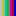

See web page in grayscale
---

## Original idea

## Features / Notable characteristics

- it can be easily turned on and off using the extension icon
  - either by clicking
  - or by navigating to the grayscale icon, using `tab` key and pressing `space`
- color of the focus indicator icon identifies the current state, ie, enabled or disabled
  -  enabled focus indicator icon
  -  disabled focus indicator icon

## Installation

## Usage

## Contributing

Please refer [Contributing guidelines](contributing.md) to enhance your contribution experience.
